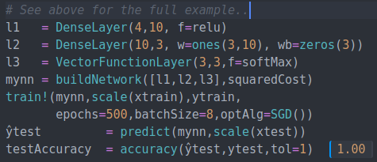

# Beta Machine Learning Toolkit

 &nbsp;&nbsp;&nbsp;

The **Beta Machine Learning Toolkit** is a repository with several basic Machine Learning algorithms, started from implementing in the Julia language the concepts taught in the [MITX 6.86x - Machine Learning with Python: from Linear Models to Deep Learning](https://www.edx.org/course/machine-learning-with-python-from-linear-models-to) course.

<!--[](https://sylvaticus.github.io/Bmlt.jl/stable) -->
[](https://sylvaticus.github.io/Bmlt.jl/dev)
[](https://travis-ci.org/sylvaticus/Bmlt.jl)
[](http://codecov.io/github/sylvaticus/Bmlt.jl?branch=master)
[](https://mybinder.org/v2/gh/sylvaticus/Bmlt.jl/master)

Theoretical notes describing most of these algorithms are at the companion repository https://github.com/sylvaticus/MITx_6.86x.

This stuff most likely has value only didactically, as the approaches are the "vanilla" ones, i.e. the simplest possible ones, and GPU is not supported here.
For "serious" machine learning work in Julia I suggest to use either [Flux](https://fluxml.ai/) or [Knet](https://github.com/denizyuret/Knet.jl).

As the focus is mainly didactic, functions have pretty longer but more explicit names than usual.. for example the `Dense` layer is a `DenseLayer`, the `RBF` kernel is `radialKernel`, etc.

That said, Julia is a relatively fast language and most hard job is done in multithreaded functions or using matrix operations whose underlying libraries are multithreaded, so it is reasonably fast for small exploratory tasks. Also it is already very flexible. For example, one can implement its own layer as a subtype of the abstract type `Layer` or its own optimisation algorithm as a subtype of `OptimisationAlgorithm` or even specify its own distance metric in the Kmedoids algorithm..

## Documentation

Please refer to the package documentation ([dev](https://sylvaticus.github.io/Bmlt.jl/dev)) or use the Julia inline package system (just press the question mark `?` and then, on the special help prompt `help?>`, type the module or function name).

Module currently implemented are [Perceptron](https://sylvaticus.github.io/Bmlt.jl/dev/Perceptron.html), [Nn](https://sylvaticus.github.io/Bmlt.jl/dev/Nn.html), [Clustering](https://sylvaticus.github.io/Bmlt.jl/dev/Clustering.html) and [Utils](https://sylvaticus.github.io/Bmlt.jl/dev/Utils.html).

We also provide some [notebooks](https://sylvaticus.github.io/Bmlt.jl/dev/Notebooks.html/Notebooks.html) that can be run online without installing anything, so you can start playing with the library in minutes.

If you are looking for an introductory book on Julia, have a look on "[Julia Quick Syntax Reference](https://www.julia-book.com/)"(Apress,2019).


### Examples

#### Using an Artificial Neural Network for multinomial categorisation

```julia
# Load Modules
using Bmlt.Nn, DelimitedFiles, Random, StatsPlots # Load the main module and ausiliary modules
Random.seed!(123); # Fix the random seed (to obtain reproducible results)

# Load the data
iris     = readdlm(joinpath(dirname(Base.find_package("Bmlt")),"..","test","data","iris.csv"),',',skipstart=1)
iris     = iris[shuffle(axes(iris, 1)), :] # Shuffle the records, as they aren't by default
x        = convert(Array{Float64,2}, iris[:,1:4])
y        = map(x->Dict("setosa" => 1, "versicolor" => 2, "virginica" =>3)[x],iris[:, 5]) # Convert the target column to numbers
y_oh     = oneHotEncoder(y) # Convert to One-hot representation (e.g. 2 => [0 1 0], 3 => [0 0 1])

# Split the data in training/testing sets
ntrain    = Int64(round(size(x,1)*0.8))
xtrain    = x[1:ntrain,:]
ytrain    = y[1:ntrain]
ytrain_oh = y_oh[1:ntrain,:]
xtest     = x[ntrain+1:end,:]
ytest     = y[ntrain+1:end]

# Define the Artificial Neural Network model
l1   = DenseLayer(4,10,f=relu) # Activation function is ReLU
l2   = DenseLayer(10,3)        # Activation function is identity by default
l3   = VectorFunctionLayer(3,3,f=softMax) # Add a (parameterless) layer whose activation function (softMax in this case) is defined to all its nodes at once
mynn = buildNetwork([l1,l2,l3],squaredCost,name="Multinomial logistic regression Model Sepal") # Build the NN and use the squared cost (aka MSE) as error function

# Training it (default to SGD)
res = train!(mynn,scale(xtrain),ytrain_oh,epochs=100,batchSize=6) # Use optAlg=SGD (Stochastic Gradient Descent) by default

# Test it
ŷtrain        = predict(mynn,scale(xtrain))   # Note the scaling function
ŷtest         = predict(mynn,scale(xtest))
trainAccuracy = accuracy(ŷtrain,ytrain,tol=1) # 0.983
testAccuracy  = accuracy(ŷtest,ytest,tol=1)   # 1.0

# Visualise results
testSize = size(ŷtest,1)
ŷtestChosen =  [argmax(ŷtest[i,:]) for i in 1:testSize]
groupedbar([ytest ŷtestChosen], label=["ytest" "ŷtest (est)"], title="True vs estimated categories") # All records correctly labelled !
plot(0:res.epochs,res.ϵ_epochs, ylabel="epochs",xlabel="error",legend=nothing,title="Avg. error per epoch on the Sepal dataset")
```

 


## TODO

### Short term

- adding other optimisation algorithms to NN
- sorting out cluster API (EM for generic mixtures)

### Long term

- Support Vector Machine (if anyone request it)
- Add convolutional layers and RNN support

## Acknowledgements

The development of this package at the _Bureau d'Economie Théorique et Appliquée_ (BETA, Nancy) was supported by the French National Research Agency through the [Laboratory of Excellence ARBRE](http://mycor.nancy.inra.fr/ARBRE/), a part of the “Investissements d'Avenir” Program (ANR 11 – LABX-0002-01).

[](hhttp://www.beta-umr7522.fr/)
