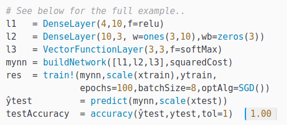
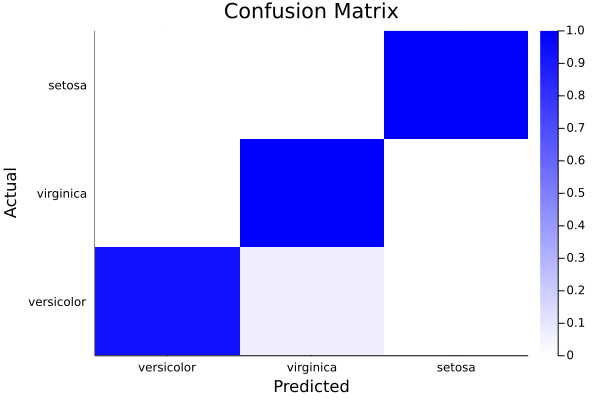

# Beta Machine Learning Toolkit

 _Machine Learning made simple :-)_

<!-- _BetaML: makes simple machine learning tasks easy, and complex machine learning tasks possible._ -->

 &nbsp;&nbsp;&nbsp;

The **Beta Machine Learning Toolkit** is a package including many algorithms and utilities to implement machine learning workflows in Julia, [Python](https://sylvaticus.github.io/BetaML.jl/stable/tutorials/Betaml_tutorial_getting_started.html#Use-BetaML-in-Python), [R](https://sylvaticus.github.io/BetaML.jl/stable/tutorials/Betaml_tutorial_getting_started.html#Use-BetaML-in-R) and any other language with a Julia binding.

[](https://sylvaticus.github.io/BetaML.jl/stable)
[](https://sylvaticus.github.io/BetaML.jl/dev)
[](https://doi.org/10.21105/joss.02849)
[](https://github.com/sylvaticus/BetaML.jl/actions)
[](http://codecov.io/github/sylvaticus/BetaML.jl?branch=master)

Currently the following models are available:

| BetaML name | MLJ Interface | Category |
| ----------- | ------------- | -------- |
| [`PerceptronClassifier`](https://sylvaticus.github.io/BetaML.jl/stable/Perceptron.html#BetaML.Perceptron.PerceptronClassifier) | [`LinearPerceptron`](https://sylvaticus.github.io/BetaML.jl/stable/Perceptron.html#BetaML.Perceptron.LinearPerceptron) | _Supervised classifier_ | 
| [`KernelPerceptronClassifier`](https://sylvaticus.github.io/BetaML.jl/stable/Perceptron.html#BetaML.Perceptron.KernelPerceptronClassifier)  | [`KernelPerceptron`](https://sylvaticus.github.io/BetaML.jl/stable/Perceptron.html#BetaML.Perceptron.KernelPerceptron) | _Supervised classifier_ | 
| [`PegasosClassifier`](https://sylvaticus.github.io/BetaML.jl/stable/Perceptron.html#BetaML.Perceptron.PegasosClassifier) | [`Pegasos`](https://sylvaticus.github.io/BetaML.jl/stable/Perceptron.html#BetaML.Perceptron.Pegasos) | _Supervised classifier_ |
| [`DecisionTreeEstimator`](https://sylvaticus.github.io/BetaML.jl/stable/Trees.html#BetaML.Trees.DecisionTreeEstimator) | [`DecisionTreeClassifier`](https://sylvaticus.github.io/BetaML.jl/stable/Trees.html#BetaML.Trees.DecisionTreeClassifier), [`DecisionTreeRegressor`](https://sylvaticus.github.io/BetaML.jl/stable/Trees.html#BetaML.Trees.DecisionTreeRegressor) | _Supervised regressor and classifier_ |
| [`RandomForestEstimator`](https://sylvaticus.github.io/BetaML.jl/stable/Trees.html#BetaML.Trees.RandomForestEstimator) |  [`RandomForestClassifier`](https://sylvaticus.github.io/BetaML.jl/stable/Trees.html#BetaML.Trees.RandomForestClassifier), [`RandomForestRegressor`](https://sylvaticus.github.io/BetaML.jl/stable/Trees.html#BetaML.Trees.RandomForestRegressor) | _Supervised regressor and classifier_ |
| [`NeuralNetworkEstimator`](https://sylvaticus.github.io/BetaML.jl/stable/Nn.html#BetaML.Nn.NeuralNetworkEstimator) | [`NeuralNetworkRegressor`](https://sylvaticus.github.io/BetaML.jl/stable/Nn.html#BetaML.Nn.NeuralNetworkRegressor), [`MultitargetNeuralNetworkRegressor`](https://sylvaticus.github.io/BetaML.jl/stable/Nn.html#BetaML.Nn.MultitargetNeuralNetworkRegressor), [`NeuralNetworkClassifier`](https://sylvaticus.github.io/BetaML.jl/stable/Nn.html#BetaML.Nn.NeuralNetworkClassifier) | _Supervised regressor and classifier_ |
| [`GMMRegressor1`](https://sylvaticus.github.io/BetaML.jl/stable/GMM.html#BetaML.GMM.GMMRegressor1) | | _Supervised regressor_ | 
| [`GMMRegressor2`](https://sylvaticus.github.io/BetaML.jl/stable/GMM.html#BetaML.GMM.GMMRegressor2) | [`GaussianMixtureRegressor`](https://sylvaticus.github.io/BetaML.jl/stable/GMM.html#BetaML.GMM.GaussianMixtureRegressor), [`MultitargetGaussianMixtureRegressor`](https://sylvaticus.github.io/BetaML.jl/stable/GMM.html#BetaML.GMM.MultitargetGaussianMixtureRegressor) | _Supervised regressor_ | 
| [`KMeansClusterer`](https://sylvaticus.github.io/BetaML.jl/stable/Clustering.html#BetaML.Clustering.KMeansClusterer) | [`KMeans`](https://sylvaticus.github.io/BetaML.jl/stable/Clustering.html#BetaML.Clustering.KMeans) | _Unsupervised hard clusterer_ |
| [`KMedoidsClusterer`](https://sylvaticus.github.io/BetaML.jl/stable/Clustering.html#BetaML.Clustering.KMedoidsClusterer) | [`KMedoids`](https://sylvaticus.github.io/BetaML.jl/stable/Clustering.html#BetaML.Clustering.KMedoids) | _Unsupervised hard clusterer_ |
| [`GMMClusterer`](https://sylvaticus.github.io/BetaML.jl/stable/GMM.html#BetaML.GMM.GMMClusterer) | [`GaussianMixtureClusterer`](https://sylvaticus.github.io/BetaML.jl/stable/GMM.html#BetaML.GMM.GaussianMixtureClusterer) | _Unsupervised soft clusterer_ |
| [`FeatureBasedImputer`](https://sylvaticus.github.io/BetaML.jl/stable/Imputation.html#BetaML.Imputation.FeatureBasedImputer)| [`SimpleImputer`](https://sylvaticus.github.io/BetaML.jl/stable/Imputation.html#BetaML.Imputation.SimpleImputer) | _Unsupervised missing data imputer_ |
| [`GMMImputer`](https://sylvaticus.github.io/BetaML.jl/stable/Imputation.html#BetaML.Imputation.GMMImputer) | [`GaussianMixtureImputer`](https://sylvaticus.github.io/BetaML.jl/stable/Imputation.html#BetaML.Imputation.GaussianMixtureImputer) | _Unsupervised missing data imputer_ |
| [`RFImputer`](https://sylvaticus.github.io/BetaML.jl/stable/Imputation.html#BetaML.Imputation.RFImputer) | [`RandomForestImputer`](https://sylvaticus.github.io/BetaML.jl/stable/Imputation.html#BetaML.Imputation.RandomForestImputer) | _Unsupervised missing data imputer_ |
| [`UniversalImputer`](https://sylvaticus.github.io/BetaML.jl/stable/Imputation.html#BetaML.Imputation.UniversalImputer) | [`GeneralImputer`](https://sylvaticus.github.io/BetaML.jl/stable/Imputation.html#BetaML.Imputation.GeneralImputer) | _Unsupervised missing data imputer_ |
| [`MinMaxScaler`](https://sylvaticus.github.io/BetaML.jl/stable/Utils.html#BetaML.Utils.MinMaxScaler) | | _Data transformer_ |
| [`StandardScaler`](https://sylvaticus.github.io/BetaML.jl/stable/Utils.html#BetaML.Utils.StandardScaler) | | _Data transformer_ |
| [`Scaler`](https://sylvaticus.github.io/BetaML.jl/stable/Utils.html#BetaML.Utils.Scaler) |  | _Data transformer_ |
| [`PCA`](https://sylvaticus.github.io/BetaML.jl/stable/Utils.html#BetaML.Utils.PCA) |  | _Unsupervised dimensionality reduction transformer_ |
| [`OneHotEncoder`](https://sylvaticus.github.io/BetaML.jl/stable/Utils.html#BetaML.Utils.OneHotEncoder) |  | _Data transformer_ |
| [`OrdinalEncoder`](https://sylvaticus.github.io/BetaML.jl/stable/Utils.html#BetaML.Utils.OrdinalEncoder) |  | _Data transformer_ |
| [`ConfusionMatrix`](https://sylvaticus.github.io/BetaML.jl/stable/Utils.html#BetaML.Utils.ConfusionMatrix) | | _Predictions assessment_ |


Theoretical notes describing many of these algorithms are at the companion repository https://github.com/sylvaticus/MITx_6.86x.

All models are implemented entirely in Julia and are hosted in the repository itself (i.e. they are not wrapper to third-party models).
If your favorite option or model is missing, you can try implement it yourself and [open a pull request](https://github.com/sylvaticus/BetaML.jl/pulls) to share it (see the section [Contribute](#contribute) below) or request its implementation ([open an issue](https://github.com/sylvaticus/BetaML.jl/issues)). Thanks to its JIT compiler, Julia is indeed in the sweet spot where we can easily write models in a high-level language and still having them running efficiently. 

## Documentation

Please refer to the [package documentation](https://sylvaticus.github.io/BetaML.jl/stable) or use the Julia inline package system (just press the question mark `?` and then, on the special help prompt `help?>`, type the module or function name). The package documentation is made of two distinct parts. The first one is an extensively commented tutorial that covers most of the library, the second one is the reference manual covering the library's API.

If you are looking for an introductory material on Julia, have a look on the book "[Julia Quick Syntax Reference](https://www.julia-book.com/)"(Apress,2019) or the online course "[Scientific Programming and Machine Learning in Julia](https://sylvaticus.github.io/SPMLJ/stable/).

While implemented in Julia, this package can be easily used in R or Python employing [JuliaCall](https://github.com/Non-Contradiction/JuliaCall) or [PyJulia](https://github.com/JuliaPy/pyjulia) respectively, see [the relevant section](https://sylvaticus.github.io/BetaML.jl/stable/tutorials/Betaml_tutorial_getting_started.html#using_betaml_from_other_languages) in the documentation.

### Examples

- **Using an Artificial Neural Network for multinomial categorisation**

In this example we see how to train a neural networks model to predict the specie's name (5th column) given floral sepals and petals measures (first 4 columns) in the famous [iris flower dataset](https://en.wikipedia.org/wiki/Iris_flower_data_set).


```julia
# Load Modules
using DelimitedFiles, Random
using Pipe, Plots, BetaML # Load BetaML and other auxiliary modules
Random.seed!(123);  # Fix the random seed (to obtain reproducible results).

# Load the data
iris     = readdlm(joinpath(dirname(Base.find_package("BetaML")),"..","test","data","iris.csv"),',',skipstart=1)
x        = convert(Array{Float64,2}, iris[:,1:4])
y        = convert(Array{String,1}, iris[:,5])
# Encode the categories (levels) of y using a separate column per each category (aka "one-hot" encoding) 
ohmod    = OneHotEncoder()
y_oh     = fit!(ohmod,y) 
# Split the data in training/testing sets
((xtrain,xtest),(ytrain,ytest),(ytrain_oh,ytest_oh)) = partition([x,y,y_oh],[0.8,0.2])
(ntrain, ntest) = size.([xtrain,xtest],1)

# Define the Artificial Neural Network model
l1   = DenseLayer(4,10,f=relu) # The activation function is `ReLU`
l2   = DenseLayer(10,3)        # The activation function is `identity` by default
l3   = VectorFunctionLayer(3,f=softmax) # Add a (parameterless) layer whose activation function (`softmax` in this case) is defined to all its nodes at once
mynn = NeuralNetworkEstimator(layers=[l1,l2,l3],loss=crossentropy,descr="Multinomial logistic regression Model Sepal", batch_size=2, epochs=200) # Build the NN and use the cross-entropy as error function. Swith to auto-tuning with `autotune=true`

# Train the model (using the ADAM optimizer by default)
res = fit!(mynn,fit!(Scaler(),xtrain),ytrain_oh) # Fit the model to the (scaled) data

# Obtain predictions and test them against the ground true observations
ŷtrain         = @pipe predict(mynn,fit!(Scaler(),xtrain)) |> inverse_predict(ohmod,_)  # Note the scaling and reverse one-hot encoding functions
ŷtest          = @pipe predict(mynn,fit!(Scaler(),xtest))  |> inverse_predict(ohmod,_) 
train_accuracy = accuracy(ytrain,ŷtrain) # 0.975
test_accuracy  = accuracy(ytest,ŷtest)   # 0.96

# Analyse model performances
cm = ConfusionMatrix()
fit!(cm,ytest,ŷtest)
print(cm)
```
```text
A ConfusionMatrix BetaMLModel (fitted)

-----------------------------------------------------------------

*** CONFUSION MATRIX ***

Scores actual (rows) vs predicted (columns):

4×4 Matrix{Any}:
 "Labels"       "virginica"    "versicolor"   "setosa"
 "virginica"   8              1              0
 "versicolor"  0             14              0
 "setosa"      0              0              7
Normalised scores actual (rows) vs predicted (columns):

4×4 Matrix{Any}:
 "Labels"       "virginica"   "versicolor"   "setosa"
 "virginica"   0.888889      0.111111       0.0
 "versicolor"  0.0           1.0            0.0
 "setosa"      0.0           0.0            1.0

 *** CONFUSION REPORT ***

- Accuracy:               0.9666666666666667
- Misclassification rate: 0.033333333333333326
- Number of classes:      3

  N Class      precision   recall  specificity  f1score  actual_count  predicted_count
                             TPR       TNR                 support                  

  1 virginica      1.000    0.889        1.000    0.941            9               8
  2 versicolor     0.933    1.000        0.938    0.966           14              15
  3 setosa         1.000    1.000        1.000    1.000            7               7

- Simple   avg.    0.978    0.963        0.979    0.969
- Weigthed avg.    0.969    0.967        0.971    0.966
```

```julia
ϵ = info(mynn)["loss_per_epoch"]
plot(1:length(ϵ),ϵ, ylabel="epochs",xlabel="error",legend=nothing,title="Avg. error per epoch on the Sepal dataset")
heatmap(info(cm)["categories"],info(cm)["categories"],info(cm)["normalised_scores"],c=cgrad([:white,:blue]),xlabel="Predicted",ylabel="Actual", title="Confusion Matrix")
```

 

- **Other examples**

Further examples, with more models and more advanced techniques in order to improve predictions, are provided in the documentation tutorial.
Basic examples in Python and R are given [here](https://sylvaticus.github.io/BetaML.jl/stable/tutorials/Betaml_tutorial_getting_started.html#using_betaml_from_other_languages).
Very "micro" examples of usage of the various functions can also be studied in the unit-tests available in the [`test`](https://github.com/sylvaticus/BetaML.jl/tree/master/test) folder. 


## Limitations and alternative packages

The focus of the library is skewed toward user-friendliness rather than computational efficiency. While the code is (relatively) easy to read, it is not heavily optimised, and currently all models operate on the CPU and only with data that fits in the pc's memory.
For very large data we suggest specialised packages. See the list below:

Category         | Packages
-----------------|-----------------
ML toolkits/pipelines | [ScikitLearn.jl](https://github.com/cstjean/ScikitLearn.jl), [AutoMLPipeline.jl](https://github.com/IBM/AutoMLPipeline.jl), [MLJ.jl](https://joss.theoj.org/papers/10.21105/joss.02704)
Neural Networks |  [Flux.jl](https://fluxml.ai/), [Knet](https://github.com/denizyuret/Knet.jl)
Decision Trees | [DecisionTree.jl](https://github.com/bensadeghi/DecisionTree.jl)
Clustering | [Clustering.jl](https://github.com/JuliaStats/Clustering.jl), [GaussianMixtures.jl](https://github.com/davidavdav/GaussianMixtures.jl)
Missing imputation | [Impute.jl](https://github.com/invenia/Impute.jl)


## TODO

### Short term

- Implement autotuning of `GMMClusterer` using  `BIC` or `AIC`
- Add Silhouette method to check cluster validity
- Implement PAM and/or variants for kmedoids

### Mid/Long term

- Add RNN support and improve convolutional layers speed
- Reinforcement learning (Markov decision processes)

## Contribute

Contributions to the library are welcome. We are particularly interested in the areas covered in the "TODO" list above, but we are open to other areas as well.
Please however consider that the focus is mostly didactic/research, so clear, easy to read (and well documented) code and simple API with reasonable defaults are more important that highly optimised algorithms. For the same reason, it is fine to use verbose names.
Please open an issue to discuss your ideas or make directly a well-documented pull request to the repository.
While not required by any means, if you are customising BetaML and writing for example your own neural network layer type (by subclassing `AbstractLayer`), your own sampler (by subclassing `AbstractDataSampler`) or your own mixture component (by subclassing `AbstractMixture`), please consider to give it back to the community and open a pull request to integrate them in BetaML.

## Citations

If you use `BetaML` please cite it as:

- Lobianco, A., (2021). BetaML: The Beta Machine Learning Toolkit, a self-contained repository of Machine Learning algorithms in Julia. Journal of Open Source Software, 6(60), 2849, https://doi.org/10.21105/joss.02849


```Bibtex
@article{Lobianco2021,
  doi       = {10.21105/joss.02849},
  url       = {https://doi.org/10.21105/joss.02849},
  year      = {2021},
  publisher = {The Open Journal},
  volume    = {6},
  number    = {60},
  pages     = {2849},
  author    = {Antonello Lobianco},
  title     = {BetaML: The Beta Machine Learning Toolkit, a self-contained repository of Machine Learning algorithms in Julia},
  journal   = {Journal of Open Source Software}
}
```


## Acknowledgements

The development of this package at the _Bureau d'Economie Théorique et Appliquée_ (BETA, Nancy) was supported by the French National Research Agency through the [Laboratory of Excellence ARBRE](http://mycor.nancy.inra.fr/ARBRE/), a part of the “Investissements d'Avenir” Program (ANR 11 – LABX-0002-01).

[](hhttp://www.beta-umr7522.fr/)
